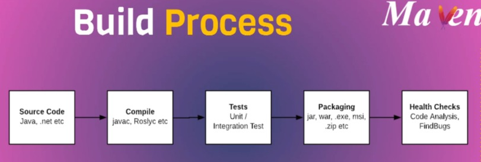
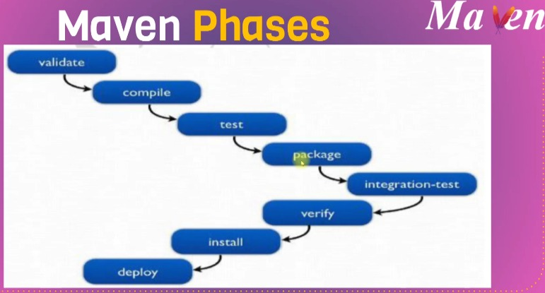

# Maven

|OBJECTIFS|
|---------|
|Présentation|
|Maven pratique|

# Présentation 

### 2) Contenu
+ Voici ce que vous y trouverez.
  + 1. Processus de construction
  + 2. Construit des outils
  + 3. Qu'est-ce que Maven
  + 4. Phases Maven
  + 5. Installation Maven
  + 6. Fichier `pom.xml`
  + 7. Commandes Maven

### 3) Processus de construction
+ Code source
+ Compiler
+ Tester
+ Package

### 4) Processus de construction
+ Code source : Java, .net, etc.
+ Compiler : javac, Rosly etc.
+ Tests : Test unitaire/d'intégration
+ Emballage : jar, war, .exe, msl, .zip etc.
+ Bilans de santé : Analyse de code, FindBugs

### 5) Outils de construction => Automatiser le processus de construction

+ **Maven**
  + Java
    + Fichier de construction : format `XML` 

+ **Ant**
  + Java
   + Fichier de construction : format `XML`

+ MsBuild
  + Le Microsoft Build Engine est une plate-forme pour créer des applications

+ Gradle
  + DSL basé sur Groovy

+ **& NANT**
  + Plateforme Windows .net

+ **Make**
  + construit des programmes exécutables et des bibliothèques à partir du code source

### 6) Un cycle de vie de construction est composé de phases

+ `validate` : -valider que le projet est correct et que toutes les informations nécessaires sont disponibles
+ `compile` : - compiler le code source du projet
+ `test` : - teste le code source compilé à l'aide d'un framework de test unitaire approprié. Ces tests ne doivent pas nécessiter que le code soit empaqueté ou déployé
+ `package` - prenez le code compilé et empaquetez-le dans son format distribuable, tel qu'un `JAR`.
+ `verify` : effectuer des vérifications sur les résultats des tests d'intégration pour s'assurer que les critères de qualité sont respectés
+ `install` : installe le package dans le référentiel local, pour une utilisation en tant que dépendance dans d'autres projets localement
+ `deploy` : effectué dans l'environnement de construction, copie le package final dans le référentiel distant pour le partager avec d'autres développeurs et projets.

  + https://maven.apache.org/guides/introduction/introduction-to-the-lifecycle.html